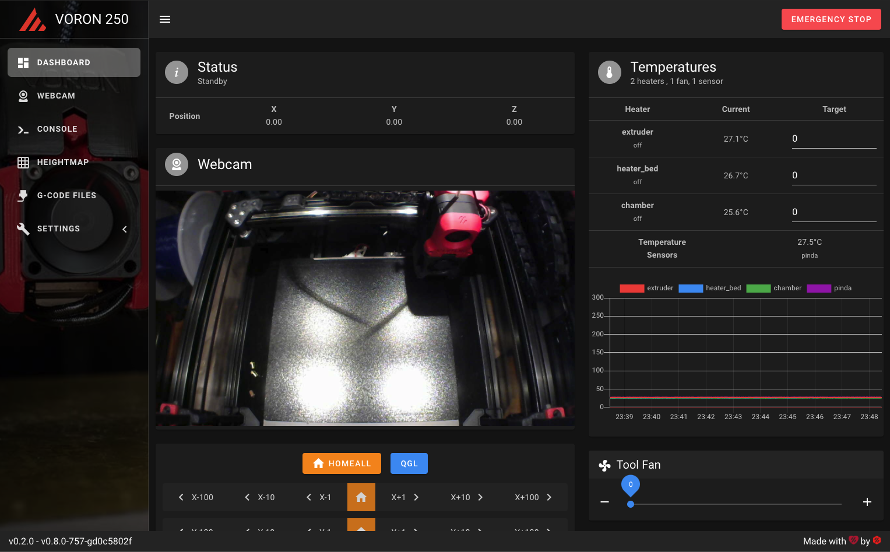

# Mainsail
Mainsail is a lightweight & responsive web interface for the [Klipper](https://github.com/KevinOConnor/klipper)
3D printer firmware. It communicates with the [Moonraker (Klipper-API)](https://github.com/arksine/moonraker) from [Arksine](https://github.com/arksine). 

To begin using Mainsail start by [installing](docs/installation.md) it or read the [documentation](docs/README.md) for more informations.