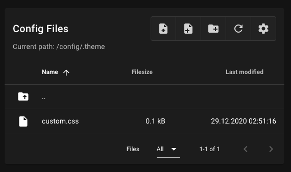
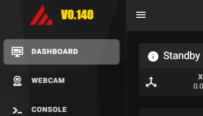
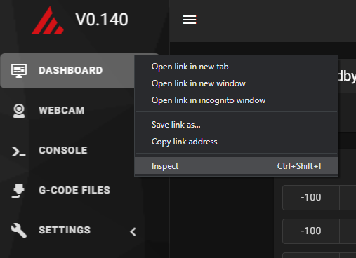
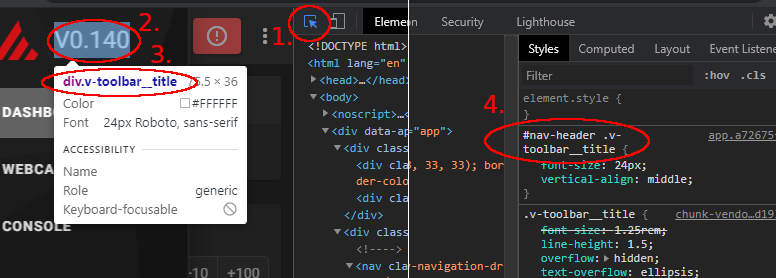
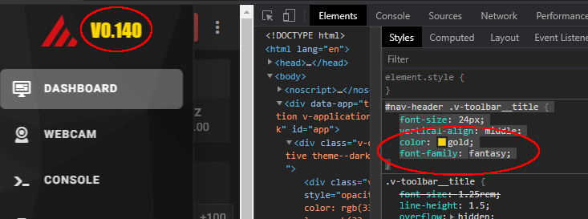
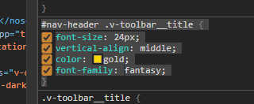
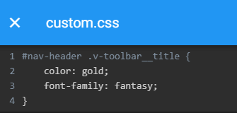

## Custom-CSS 

The custom.css file allows you to customize the appearance of Mainsail
without the need of rebuilding it. All you need to do is to place a file
named "custom.css" into the configuration directory ".theme" and define
your css rules in there.

### How to CSS

You need to be familiar with the CSS (**C**ascading **S**tyle **S**heets) syntax.
There are many resources to learn CSS online, for example:
- https://www.w3schools.com/css/default.asp

#### find the Element selector (example based on Chrome Browser)

Use your browser's built-in developer tools to find the right selector of the element you want to add your own flair to.

Open the developer tools:

right click anywhere on the page and select "inspect" (or F12 on the keyboard)

1. Activate the "inspector" 
2. Select the desired element
3. Find the selector
4. Use the style editor and fiddle arround 

When you have achieved your desired appearance copy the full "section" including selector and curly braces

Then copy it to the "custom.css" file (you can keep everything or only what you have added)

NOTE: After saving, your browser may need a uncached reload to show the change (https://en.wikipedia.org/wiki/Wikipedia:Bypass_your_cache#Bypassing_cache)
