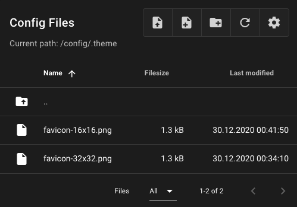

## Custom favicon
Upload the images with the name "favicon-16x16.png" and "favicon-32x32.png"
to the .theme folder. Allowed extension is only .png. The "favicon-32x32.png"
is required. The "favicon-16x16.png" is optional. Maybe a hard refresh is
necessary (CTRL+SHIFT+F5 on windows or CMD+SHIFT+R on mac). 

