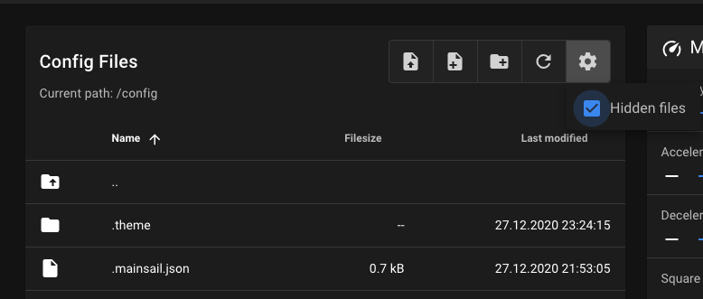

## Prepare theme

To prepare mainsail to use themes, you only have to create the ".theme" directory. Go into
"Settings" > "Machine" and check if you have enabled "Hidden files". Then you can create a
directory with the name ".theme". Important is the "." on the beginning. All further customizing
files, will be placed in this directory.

