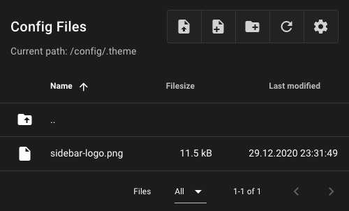

## Sidebar customizing

### Change sidebar logo
Upload an image with the name "sidebar-logo" to the .theme folder.
Allowed file extensions for the image are: .svg, .jpg, .png and .gif.

### Change sidebar background image
Upload an image with the name "sidebar-background" to the .theme folder.
Allowed file extensions for the image are: .jpg, .png and .gif. The
recommended image size is 300x1000px.

