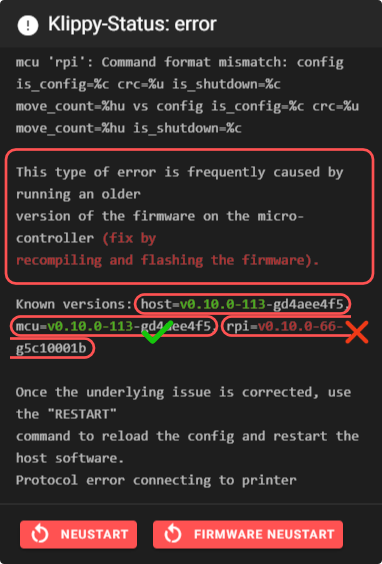

# Klipper Error - Command format mismatch

You have updated Klipper and now you get this cryptic error message?

This is an error and needs to be fixed to make Mainsail and Klipper work again.
{: .info}

## TL;DR

Klipper on your host and on your MCU have different versions. 
Recompile and flash your MCUs and it will work again. Please also pay attention to the "Linux MCU", if you had e.g. an adxl345 in use.

The following links should help you to solve the problem:  
[Klipper SD-Card Updates](https://www.klipper3d.org/SDCard_Updates.html){:target="_blank"}  
[Klipper Building and flashing the micro-controller](https://www.klipper3d.org/Installation.html#building-and-flashing-the-micro-controller){:target="_blank"}

## More detailed

Klipper consists of two parts: 
The software on your host (e.g. Raspberry Pi) and the firmware on your microcontroller (MCU).

Under normal circumstances, Klipper (on your host) can simply be updated from Mainsail without any problems and everything will work as expected.

From time to time it happens that there are changes in Klipper that make it necessary to update all your MCUs. Assuming you have run a Klipper update and Klipper on your host now supports commands that your MCUs does not understand. Then you will get the above error message.

Fortunately, these kind of updates don't happen very often, but now it has happened to you. ;-)

In order to solve the problem, you need to update all your MCUs. We are talking about multiple MCUs here, as people tend to forget that they have multiple microcontrollers in use. One of these candidates is the "Linux MCU" that many people install on their Raspberry Pi to measure resonances with an adxl345.

Detailed information on how to update the firmware can be found in the Klipper Documentation linked above (under TL;DR).

As far as we know, work is in progress to let Klipper update the firmware on its own.
{: .info}