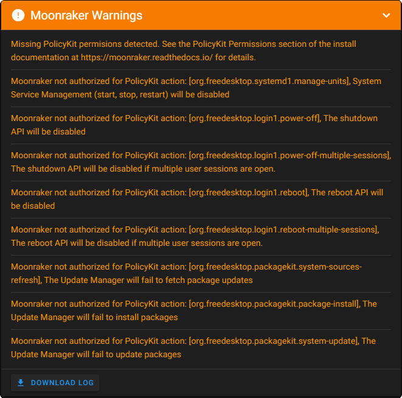

# PolicyKit Permissions
Since Jan 28th '22, Moonraker has changed the way to communicate with system services to D-Bus instead of previously `sudo` commands.

After updating Moonraker you might be presented this warning message:

{:width="50%"}

To resolve this warning you have to install the PolicyKit permissions with the `set-policykit-rules.sh` script.

SSH into your system and execute the following commands:

```
cd ~/moonraker/scripts  
./set-policykit-rules.sh  
sudo service moonraker restart
```

For more information, please check out the corresponding [Moonraker documentation](https://moonraker.readthedocs.io/en/latest/installation/#policykit-permissions).
{: .info}