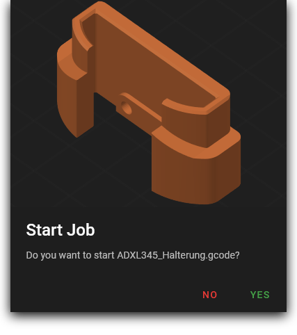
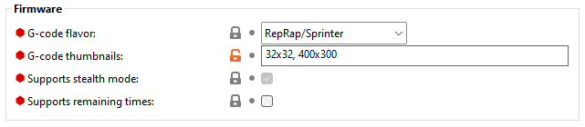
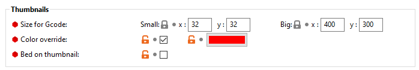
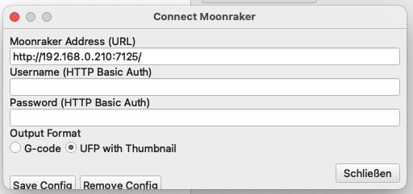
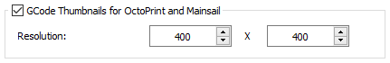

# {{ page.title }}
{: .no_toc}
{{ page.description }}

  

    Slicers
  

  {: .text-delta }
1. TOC
{:toc}

## PrusaSlicer (since v2.3.0)

In "Expert" mode PrusaSlicer has an option in the "Printer Settings" tab to activate previews.
Under `General / Firmware`, enter `32x32,400x300` as "G-code thumbnails".

  <iframe type="text/html" src="https://www.youtube.com/embed/4nFqfq8kikU" frameborder="0"></iframe>

## SuperSlicer (since v2.2.54.0)

In "Expert" mode SuperSlicer has some very convenient options in the "Printer Settings" tab to activate and customize the previews.

  <iframe type="text/html" src="https://www.youtube.com/embed/xdOM5Uco9hM" frameborder="0"></iframe>

## Cura

The Cura plugin "Cura2Moonraker" is required for this. You can find this plugin and a install guide
here: [https://github.com/emtrax-ltd/Cura2MoonrakerPlugin](https://github.com/emtrax-ltd/Cura2MoonrakerPlugin)

## ideaMaker (since v4.2.1)

To enable thumbnails, open the `Advanced` tab in the `printer settings`, enable the `GCode Thumbnails for Octoprint and Mainsail` option and
enter your prefered *square format* image size in the `Resolution` fields (e.g. `400 X 400`).
It's necessary that the thumbnail width and height resolution is equal.

