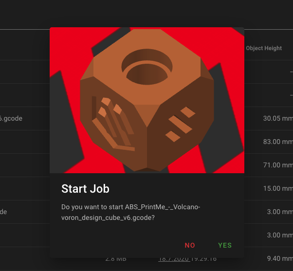

# Gcode-thumbnails with PrusaSlicer and SuperSlicer
Mainsail can display these thumbnails in the gcode filemanager. To enable the thumbnails,
open your slicer (PrusaSlicer or SuperSlicer) click on `Help > Show Configuration Folder`
and then inside the `printers` sub-folder you’ll find your printer profiles.

Open your desired printer profile in your favorite text editor and find the `thumbnails =`
section and add the resolutions `32x32,400x300`. Save the file and restart your slicer.

Now you should see a preview in the filemanager and if you will start a new job.

