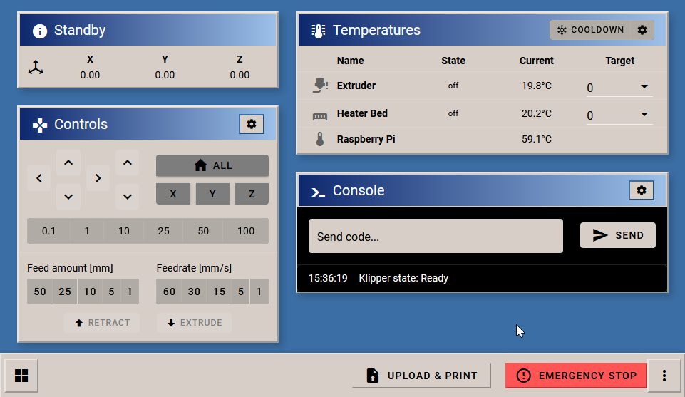
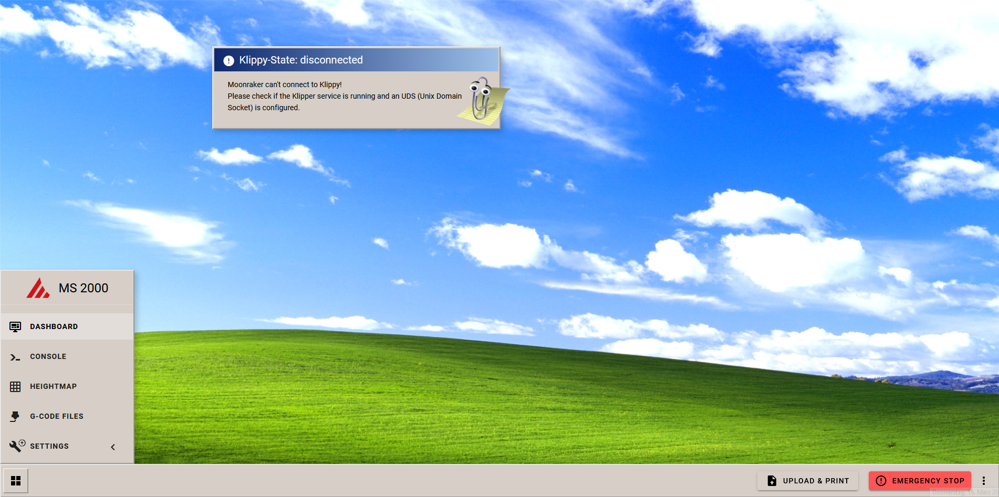
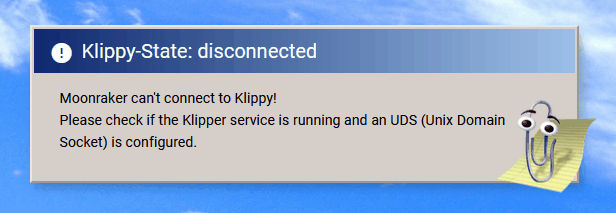

# Sneak Peak
Some users have asked which new features are planned for Mainsail 2.0. So we would like to give you a little sneak peak.

# Ground breaking changes
We have completely rethought the system of Mainsail and MainsailOS and will further bring the OS aspect to the focus. This will include a **complete design overhaul** to integrate **the all new help assistant**.

Due to the major changes we will probably jump directly to **Mainsail 2000** instead of 2.0.

{: style="display: block; margin-left: auto; margin-right: auto; width: 50%;"}

# New UI
- Works especially well on small displays. For example, with a resolution of 800x600 pixels.
- Dark theme was tossed overboard. This provides new possibilities in design.
- The new menu arrangement is especially targeted at mobile devices and short thumbs.

# Easy to customize
Throw your own wallpaper in the folder and you are ready to go.

# Clippy, our Smart Assistant
Mainsails new smart assistant *Clippy* is always there to help and advise.

He may be receiving support from *Wizard* in the near future, who could help you with your printing problems.

