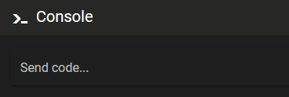

# {{ page.title }}
{{ page.description }}

## Help command

Issue a `HELP` command to get a list of possible commands.

## Autocomplete

You can start typing a command and then complete it with the tab-key. If there are several possibilities, you will get a list of choices.

## Scroll through commands

Using the &uarr; up / &darr; down  arrow keys you can scroll through previous commands.