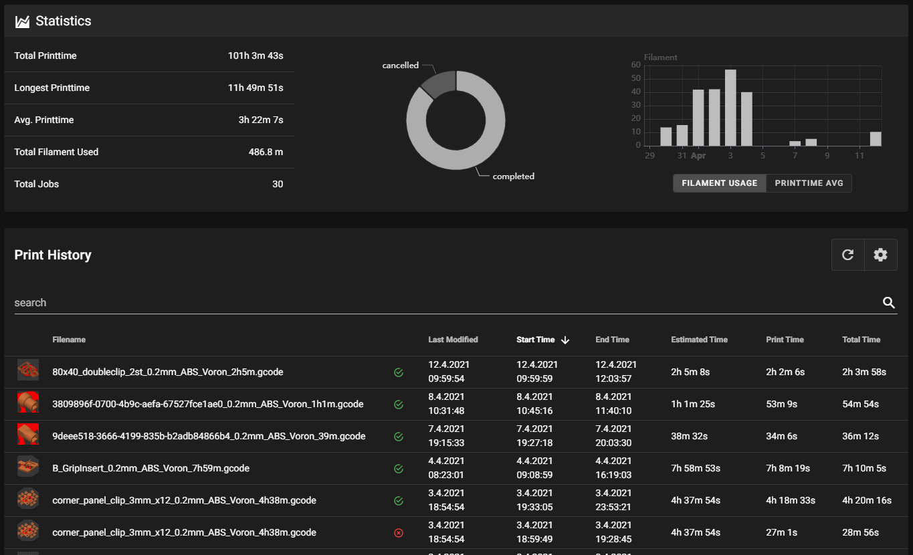

# {{ page.title }}
{{ page.description }}  
It's also possible to reprint jobs.

{: style="width: 50%;"}

## Enable print history tracking

For this, it is necessary to enable print history tracking in moonraker.

Just add `[history]` to your moonraker.conf and restart moonraker.

The new history entry will appear in Mainsails sidebar.

