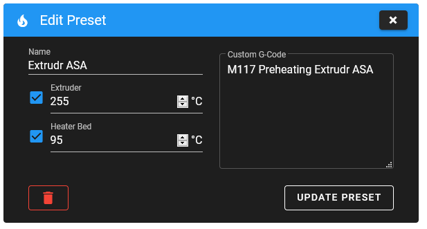
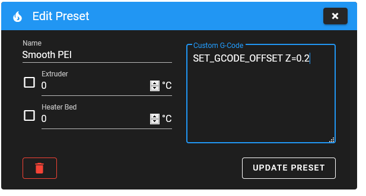

# {{ page.title }}
{{ page.description }}

## Setup
In Mainsails interface settings you will find a section called "Preheat Presets". There you can set your presets via "ADD PRESET" and the following dialog.

### Preheat

Enter a name \(e.g. name, color and type of filament\) and the temperatures obtained. You can disable individual heaters and even specify a custom gcode for the preheat phase. The gcode will be executed after the selected temperatures are set.

### Further Examples

#### Z-Offset

To quickly switch between different Z-offsets \(flexplates with smooth and textured surfaces\), you can create presets and deactivate the heaters. 

As G-Code you simply enter `SET_GCODE_OFFSET Z=0.2`, of course with your determined offset.

