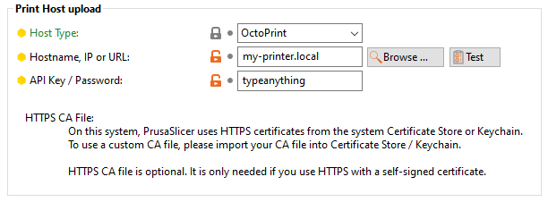
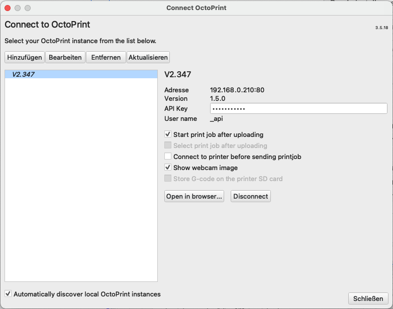

# {{ page.title }}
{{ page.description }}  
Moonraker has compatibility with Octoprint's API. To enable octoprint api compatibility,
add the following to your `moonraker.conf and restart Moonraker.

```
[octoprint_compat]
```


### PrusaSlicer/SuperSlicer (prior to v2.3.0)

If not already been done, switch to advanced or expert mode and set the options under `Printer Settings / General` as shown in the screenshot below.
For "API Key" you can type anything.



### PrusaSlicer/SuperSlicer (since v2.3.0)
A "Physical Printer" must be defined to configure the settings from above.  
More detailed instructions will follow.

### Cura with OctoPrint-Connect
Install the OctoPrint-Connection plugin via Marketplace. In `Settings > Printer > Manage Printers...`
you can find the Button `Connect OctoPrint`. Add your printer and type anything in the `API Key` field.


