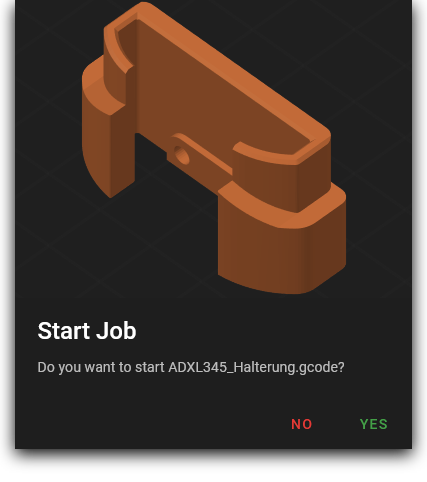
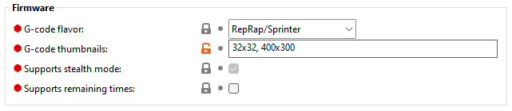
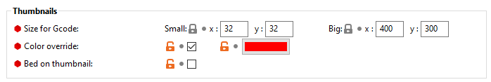
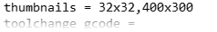

# {{ page.title }}
{{ page.description }}

### PrusaSlicer (since v2.3.0)

In "Expert" mode PrusaSlicer has an option in the "Printer Settings" tab to activate previews.
Under `General / Firmware`, enter `32x32,400x300` as "G-code thumbnails".

### SuperSlicer (since v2.2.54.0)

In "Expert" mode SuperSlicer has some very convenient options in the "Printer Settings" tab to activate and customize the previews.

### PrusaSlicer/SuperSlicer

To enable thumbnails, click on `Help > Show Configuration Folder` and navigate to your printer profiles inside the `printer` folder.
Open your printer profile in a text editor and find `thumbnails =` and add the resolutions `32x32,400x300`. Save the file and restart your Slicer.

From now on the gcode files contain thumbnails displayed by mainsail.
