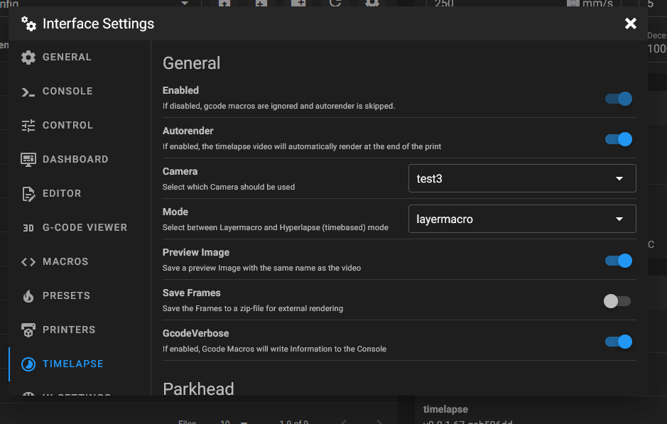

# {{ page.title }}
{{ page.description }}

If you specified any config in moonraker.conf, the config will be disabled in mainsail. Remove the config in moonraker.conf to able to change it in mainsail
{: .info}

## General

### Enabled
Enables or disables the plugin.
In a disabled state gcode macros are ignored and autorender is skipped.
This helps if you have macros setup in your slicer but like to manually
skip timelapse for a print.

### Autorender
Enables or disables automatic trigger of the render process
at the end of the print. Alternatively you can use the 'TIMELAPSE_RENDER' in
your end gcode or the Render button in mainsail.

### Camera
This setting let you choose which camera should be used to take frames from.
It depends on the 'webcam' namespace in the moonraker DB and uses the
'snapshoturl' associated whith selected camera.

### Mode
At the moment there are to modes available 'layermacro' and 'hyperlapse'

#### Layermacro 
This mode uses a macro to trigger frame grabbing, but needs the slicer to be setup
to add such on layerchange (refer to the 'Slicer setup' below) 

#### Hyperlapse
This mode takes a frame every x seconds configured by the hyperlapse_cycle setting

#### Hyperlapse_cycle
Defines the time interval in which a frame gets taken in the hyperlapse mode.

### Saveframes
Enables or disables packing the frames to a zip file for external
use or render.

### Camera
This setting let you choose which camera should be used to take frames from.
It depends on the 'webcam' namespace in the moonraker DB and uses the
'snapshoturl' associated whith selected camera.

### GcodeVerbose
Enables or disables verbosity of the Macros

## parkhead
Enables or disables parking the printhead before taking a frame.

### parkpos
This defines the position where to park the printhead before taking a frame.
Possible configurations are [center, front_left, front_right, back_left, back_right, custom]

#### Custom parkpos
If you like to define a custom parkposition of your printhead.

#### park_custom_pos_x
Absolut X coordinates of the custom parkposition (Unit [mm])

#### park_custom_pos_y
Absolut Y coordinates of the custom parkposition (Unit [mm])

#### park_custom_pos_dz
Relative Y coordinates of the custom parkposition (Unit [mm])
        
### park_travel_speed
Speed of the printhead movement while parking (Unit mm/s)

### park_retract_speed
Speed of the retract while parking (Unit mm/s)

### park_extrude_speed
Speed of the extrude when resuming the print (Unit mm/s)

### park_retract_distance
Distance to retract the filament to prevent oozing (Unit mm)

### park_extrude_distance
Distance to extrude to fill the nozzle before resuming the print (Unit mm)

## Render specific

### time_format_code
This defines how the rendered video should be named. 
It uses the python datetime format. Default is "%Y%m%d_%H%M".
More info about the datetime format can be found here https://docs.python.org/3/library/datetime.html#strftime-and-strptime-format-codes

### output_framerate
Defines the Framerate of the video. (Unit frames per second)
Note: this will be ignored if variable_fps is enabled.

### variable_fps
Enables or disables variable calcuation of the output framerate.
This uses the count of taken frames and 'targetlength', but is limited by
'variable_fps_min' and 'variable_fps_max' settings.

### targetlength
Defines the target length of a video (Unit seconds)

### variable_fps_min
Minimum fps for variable_fps (Unit frames per second).

### variable_fps_min
Maximum fps for variable_fps (Unit frames per second).

### constant_rate_factor
This configure quality vs filesize of the rendered Video. The range of the CRF 
scale is 0–51, where 0 is lossless, 23 is the default and 51 is worst quality
possible. A lower value generally leads to higher quality and a subjectively
sane range is 17–28. Consider 17 or 18 to be visually lossless.
more info: https://trac.ffmpeg.org/wiki/Encode/H.264

### pixelformat
Defines the pixelformat of the output video. Some older h264 devices like
mobiles and others need 'yuv420p' which is default the timelapse component.
To get more info which pixelformats are available run 'ffmpeg -pix_fmts' in 
your system console or refer to the ffmpeg documentation: https://ffmpeg.org/ffmpeg.html

### duplicatelastframe
Duplicates the last frame to the end of the output video.

### rotation 
Rotates the output video 0-359 degrees. (Unit degree)
Note: This will be disabled if extraoutputparams are specified.

### extraoutputparams
Defines extra output parameters to FFMPEG 
further info: https://ffmpeg.org/ffmpeg.html 
Note: Specifing anything here will disable the rotation setting. You can use
advanced filters to achieve a rotation in combination with other filters though.

### previewImage
Enables or disables coping the last frame as a preview image to
the output directory. This is used so that the mainsail can show a thumbnail of 
the timelapse.
