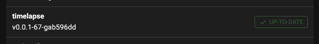

# {{ page.title }}
{{ page.description }}

## Installation
To install the Component you need to connect to your Raspberrypi via ssh and
execute following commands:

```
cd ~/
git clone https://github.com/mainsail-crew/moonraker-timelapse.git
bash ~/moonraker-timelapse/install.sh
```

This will clone the repository and execute the installer script.

The install script assumes that Klipper and Moonraker is installed in your home directory under
"klipper": `~/klipper` and "moonraker": `~\moonraker`.
{: .info}

Multi instance installations aren't supported by the installer script at \
at the moment! Please refer to the [github issue 13](https://github.com/mainsail-crew/moonraker-timelapse/issues/13)
{: .warning}


## Enable updating
The timelapse plugin can be updated with the update manager of moonraker. To do so add following to your 'moonraker.conf'

```
# moonraker.conf

[update_manager timelapse]
type: git_repo
primary_branch: main
path: ~/moonraker-timelapse
origin: https://github.com/mainsail-crew/moonraker-timelapse.git

```
with this you will be able to auto update the plugin:


## Activate the component
Activate the component by adding following to your moonraker.conf

```ini
# moonraker.conf

[timelapse]
##   Following basic configuration is default to most images and don't need
##   to be changed in most scenarios. Only uncomment and change it if your
##   image differ from standart installations. In most common scenarios 
##   a user only need [timelapse] in there configuration.
#output_path: ~/timelapse/
##   Directory where the generated video will be saved
#frame_path: /tmp/timelapse/
##   Directory where the temporary frames are saved
#ffmpeg_binary_path: /usr/bin/ffmpeg
##   Directory where ffmpeg is installed
```

Most people don't need to change anything here.
{: .info}

Multi instance users need to specifiy a separate directories for frame_path for each instance!
{: .warning}