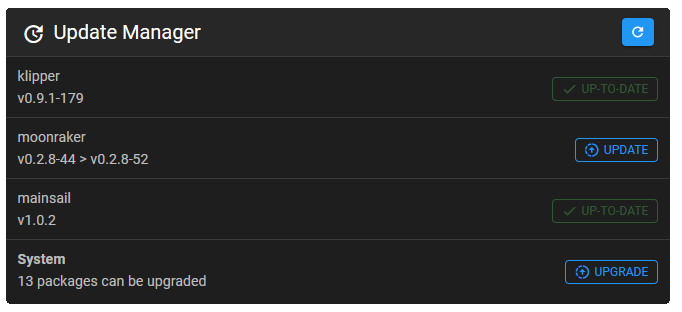

 
# {{ page.title }}
{{ page.description }}

## Moonraker.conf

Add the following section to your printers moonraker.conf:

```yaml
[update_manager]

[update_manager client mainsail]
type: web
repo: meteyou/mainsail
path: ~/mainsail
```

Once you have restarted the moonraker service, the Update Manager will appear in Mainsails machine settings.




You can find further information on this topic by checking out the [Moonraker documentation](https://github.com/Arksine/moonraker/blob/master/docs/configuration.md#update_manager){:target="_blank"}.
{: .info}
