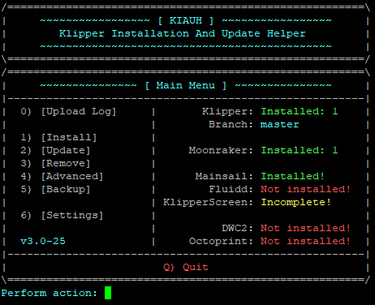

# Installing Mainsail with KIAUH

[KIAUH](https://github.com/th33xitus/kiauh) is a handy tool that helps you install or upgrade Klipper, Moonraker, Mainsail and various other extensions easily and comfortably.

For more information and get to the guide click [here](https://github.com/th33xitus/kiauh).