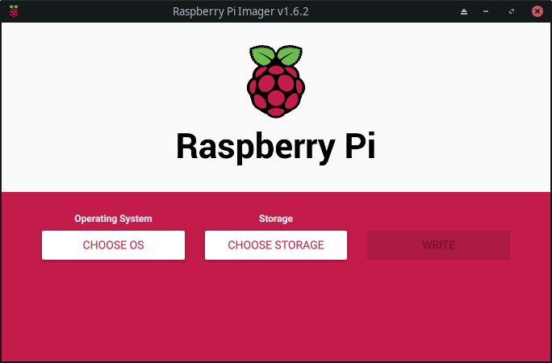
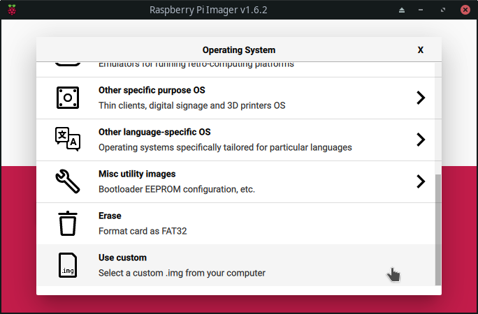
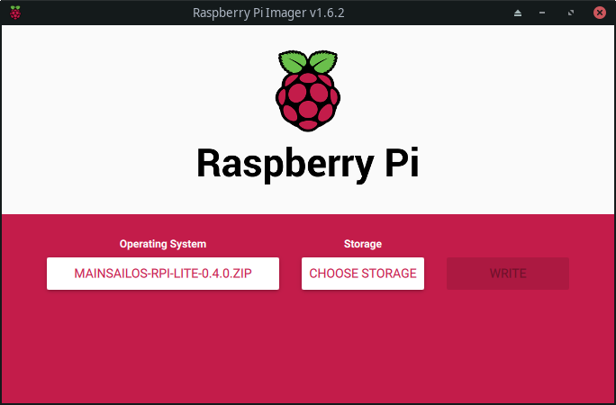
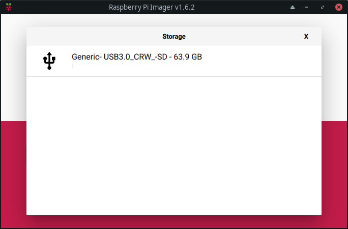
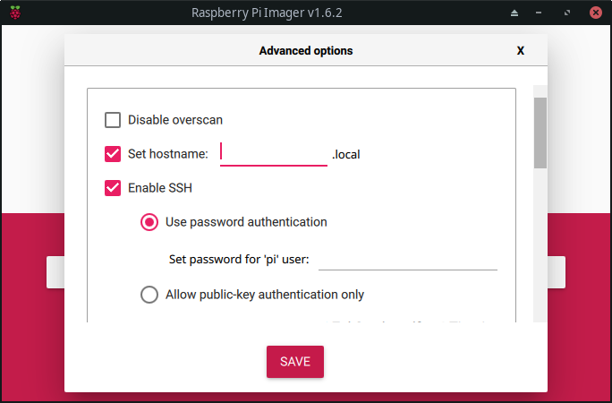
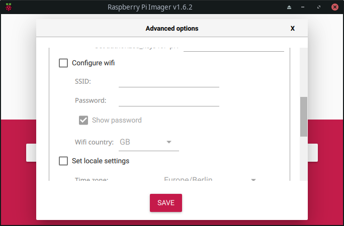
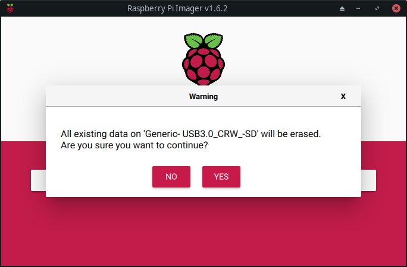
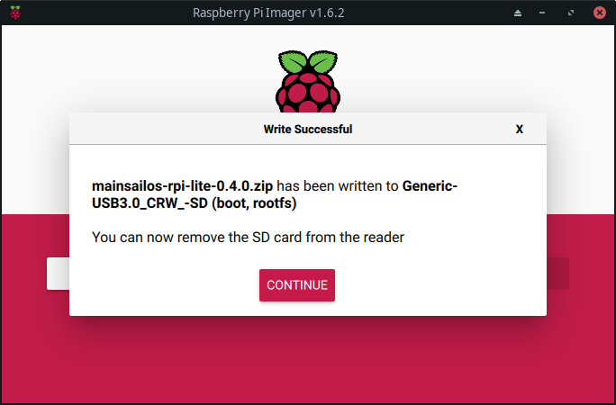

# Installing Mainsail with MainsailOS

Our recommended way to install Mainsail on a Raspberry Pi is to use [MainsailOS](https://github.com/raymondh2/MainsailOS),
as pre-packaged disk image. If you are building a custom configuration, you may need to skip
these instructions and install Mainsail [manually](manual-setup/index.md).

_Note: It is a good idea to use a premium SDcard from a reputable manufacturer such as Sandisk, Kingston or Samsung. Perfomancewise you should consider using a "A1" or better, marked SDCard. Low end cards will often fail quickly when used in this application  
**PLEASE OBEY THAT THIS WILL DESTROY ALL DATA ON YOUR CARD**_  
{: .alert}

1.  Download the latest [mainsailOS Release](https://github.com/raymondh2/MainsailOS/releases).
2.  Download the latest [Raspberry Pi Imager](https://www.raspberrypi.org/software/), henceforth rpi-imager.
3.  Install and Open rpi-imager. Now you should see a Window like this.

    

    _Window Appereance depends on OS, in this case Linux with XFCE was used._  
    {: .info}

4. Now click on "CHOOSE OS", this will open a popup as shown below.
Click on "Use Custom"

    

    This will open a Popup Window to browse your local files. Please navigate to your recently downloaded MainsailOS Zip Archive

    _**DO NOT UNPACK THE ZIP FILE!**_  
    {: .alert}

    After you've done that, it should look like this

    

5. Click on "Storage" and select your desired SDCard.

    
    _As an Example..._

6. Now its time to setup things like Hostname, Wifi, Language and more.
It depends on your needs what you setup, but it has to be WIFI and SSH at least!
Grab your Keybord and hit:

     <kbd>CTRL</kbd>+<kbd>SHIFT</kbd>+<kbd>X</kbd>

    This opens up a Setup Page

    

    

7. As last Step click on "Write", rpi-imager will give you a Warning. Click "YES" to continue...

    

8. Watch the Progressbar and wait until you see:

    
    Hit the "Continue" Button and remove safely your SDCard. ( eg. unmount on Linux )

9. Insert the SDcard into your Pi, and power on the Pi.

    _Note: Please give the PI some time, during the first boot MainsailOS (like every PI Image) will expand your "root" filesystem accordingly to your SDCard Size! The greater your SDCard is, it will take longer time! Watch out for the little green LED if it turn off or blink from time to time it has finished the resizing._  
    {: .warning}
    _**Make sure that your MCU(s) is connected to your pi, If you will be using wired networking, also make sure your ethernet cable is connected.**_  
    {: .alert}

10. Find your pi on the network, open up your preferred Browser and type either your IP or Hostname (Depends on your Network configuration)

-   If your network supports bonjour, the pi should show up as `mainsailos.local` or the given Hostname in the Setup Section.
-   If your network automatically assigns DNS hostnames, it may simply show up as `mainsailos` or accordingly given Hostname.
-   Failing these two options, you may need to check your router's DHCP server, and find out what IP address as been assigned to the device.

_**After you're able to get to the Mainsail Webinterface you should consider to Update the System to get latest features. Mainsail, Klipper and Moonraker got an relative fast Development Cycle. We can't provide MainsailOS Image with all the latest and greatest. So we encourage you to Update on first Login**_  
{: .info}

_If you decide to update, you should update in following order:_

1.  System Update (Bring latest RaspberryOS Updates to the System)
2.  Klipper Update ( To get latest Firmware, often flashing the MCU can wear out his memory )
3.  Moonraker ( Having latest Version, could lead to more Features in Frontend )
4.  Update Mainsail ( The most important! :P )

5.  **Important:** Include the mainsail.cfg into your printer.cfg
    This could be done by:

            [include mainsail.cfg]

6.  Enjoy Mainsail!
