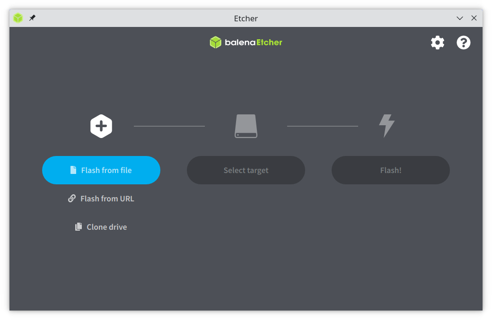
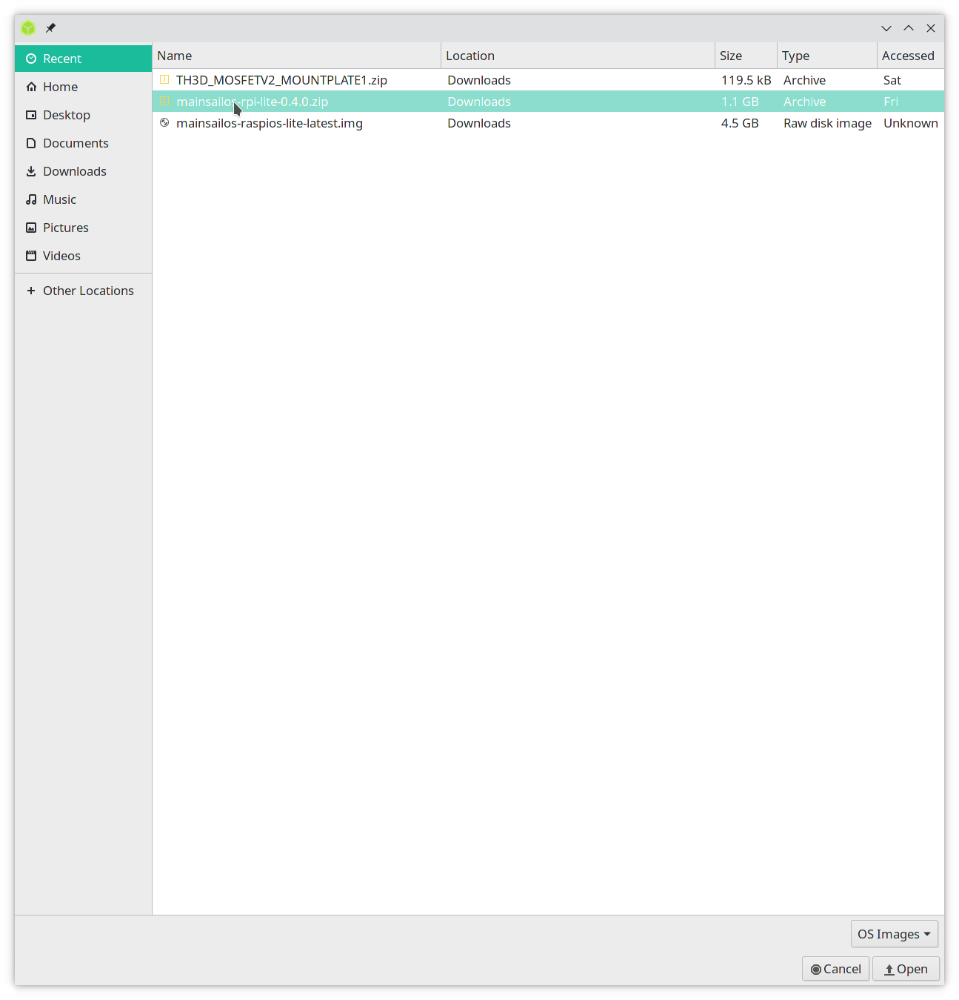
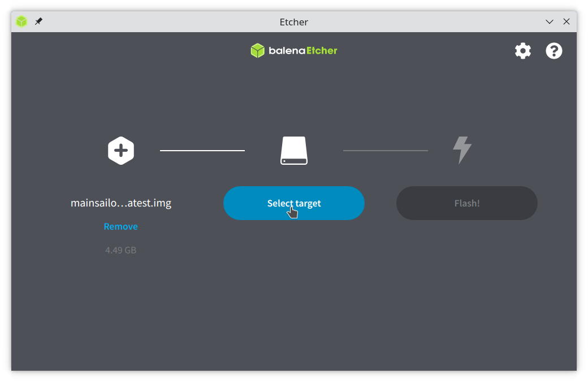
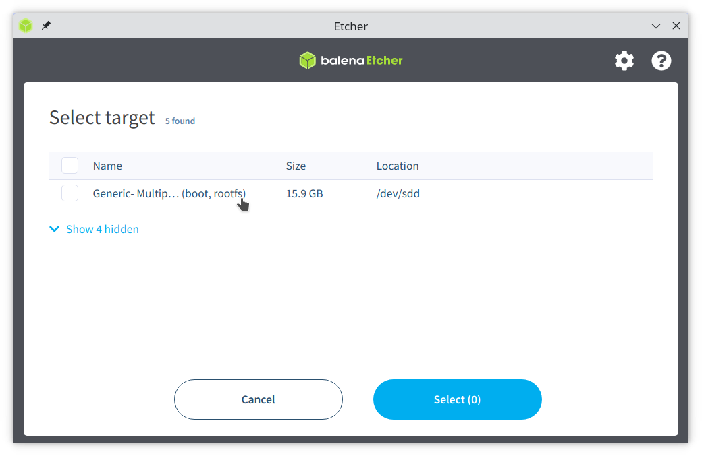
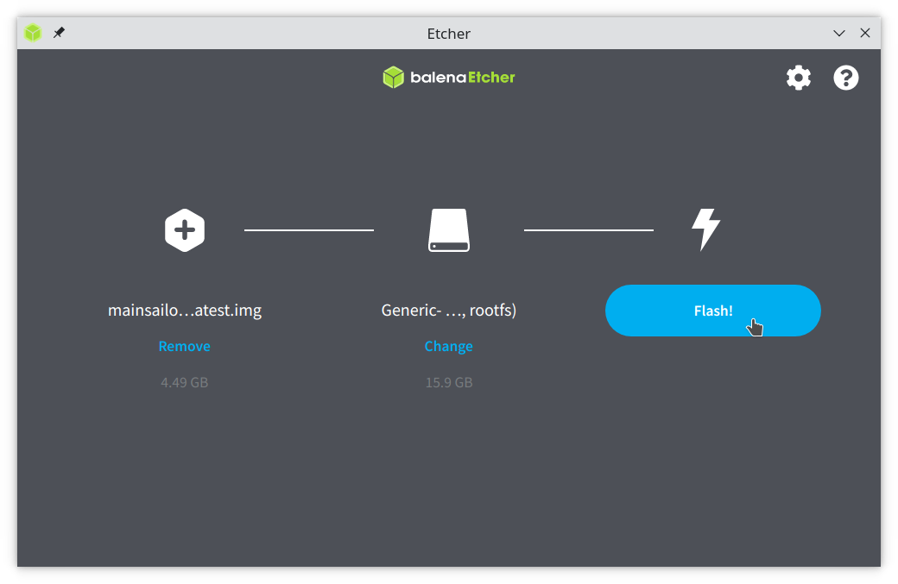
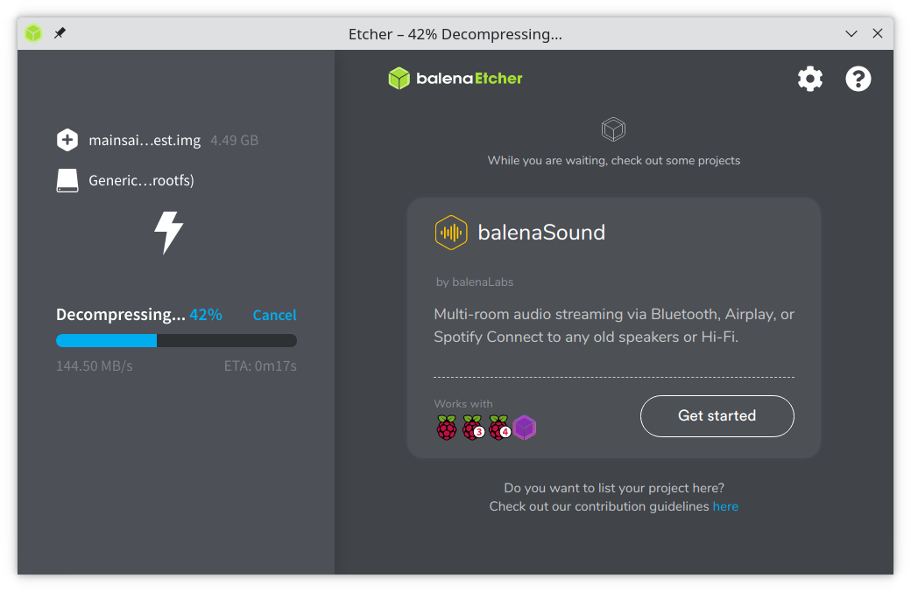
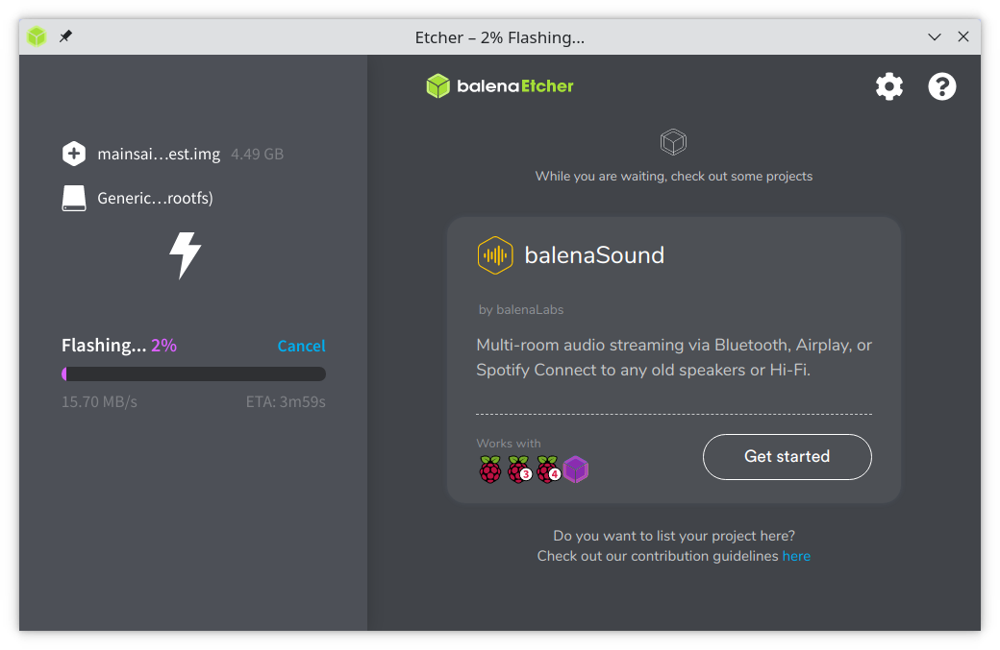
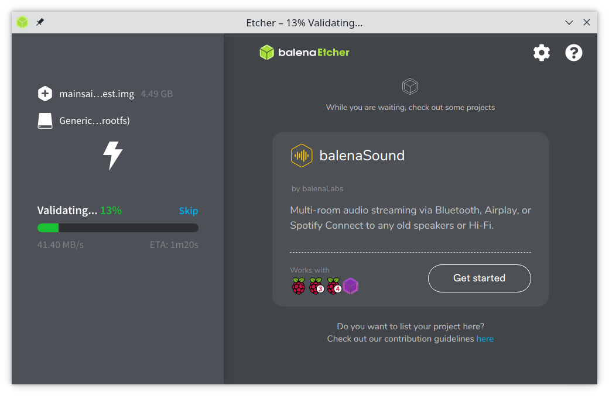
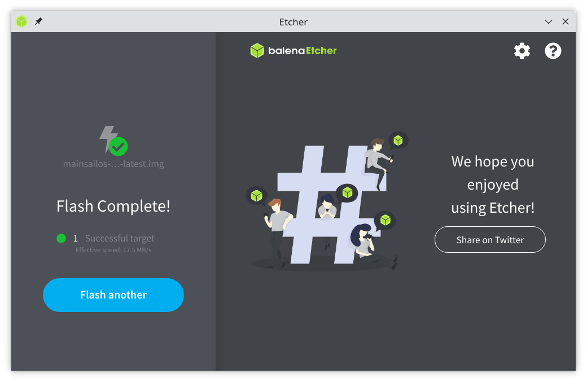
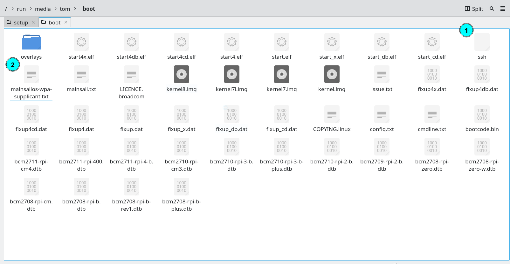

This method requires manual setup for SSH and Wi-Fi.
{: .info}
This method is cross-platform and works with Windows, Linux and MacOS.
{: .info}

We **strongly** recommend you use a premium SD card from a reputable manufacturer such as Sandisk, Kingston or Samsung, using an "A1" (or better) grade SD card. \
\
Low end cards will often fail quickly when used in this application.
{: .warning}

**FLASHING WILL DESTROY ALL DATA ON YOUR SD CARD AND CANNOT BE REVERSED**
{: .alert}

____

# Preparation

Whilst this guide makes specific use of balenaEtcher it is entirely possible to use any flashing software of your choice and then follow the manual steps to enable SSH / network after. 

*  [Download](https://github.com/mainsail-crew/MainsailOS/releases) the latest MainsailOS release (don't unpack the zip; you don't need to).
*  [Download](https://www.balena.io/etcher/) and install the latest balenaEtcher.

# Flashing MainsailOS

balenaEtcher appearance may vary depending on the host OS.
{: .info}


* When opening balenaEtcher you will be presented with the following:


* Select the 'Flash from file' button ('Select image' on Windows) and navigate to the downloaded MainsailOS zip.


* Select the 'Select target' button and choose the SD card you want to flash.



* Return the the main screen, and select 'Flash'. Accept any warnings to continue.

**FLASHING WILL DESTROY ALL DATA ON YOUR SD CARD AND CANNOT BE REVERSED**
{: .alert}



* balenaEtcher will now decompress (unzip) the MainsailOS archive, write the disc image to the card and verify the flash. 




* balenaEtcher will confirm the flash is complete.


# Enabling SSH
You may need to safely remove (eject) the SD card and reinsert it for the /boot partition to show.
{: .info}

Before you move on, it is important to check SSH is enabled. 

This is done by creating an empty file with no extension named 'SSH', or 'SSH.txt' in the /boot partition of the SD card. MainsailOS includes this file. 



If for some reason the file is not present, then on linux it can be created by navigating to the /boot partition and opening a terminal:

```bash
sudo touch SSH
sudo touch SSH.txt
```

 RaspberryOS will check if /boot/SSH(.txt) is present at first boot. If the file is present then SSH will be enabled.


# Setting up Wi-Fi / Network

SSID's are case-sensitive!
{: .info}
Don't forget to set the country!
{: .warning}


To setup Wi-Fi for a headless Pi install the network SSID and password must be entered into mainsailos-wpa-supplicant.txt 

With the SD card inserted into the computer, navigate to the SD card's /boot partition and open mainsail-wpa-supplicant.txt.

Locate the relevant section to your network, remove the comment marks (#) and enter the SSID and password. WPA/WPA2 is the most common.

```yml
Original:
## WPA/WPA2 secured
#network={
#  ssid="put SSID here"
#  psk="put password here"
#}

Filled out:
## WPA/WPA2 secured
network={
  ssid="CaseSensitive_WIFI"
  psk="SuperSecrets"
}

...

# Uncomment the country your Pi is in to activate Wifi in RaspberryPi 3 B+ and above
# For full list see: https://en.wikipedia.org/wiki/ISO_3166-1_alpha-2
country=GB # United Kingdom

```
Save and exit the mainsailos-wpa-supplicant.txt file. 

You are now ready to move on to the [first boot](first-boot) of MainsailOS.


---
[< tool selection](../mainsail-os.md){: .btn }  [next step >](first-boot){: .btn }
