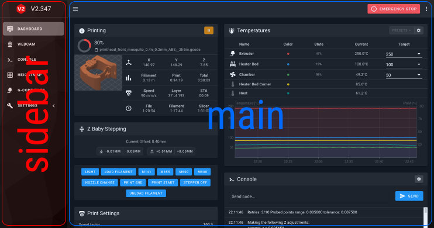
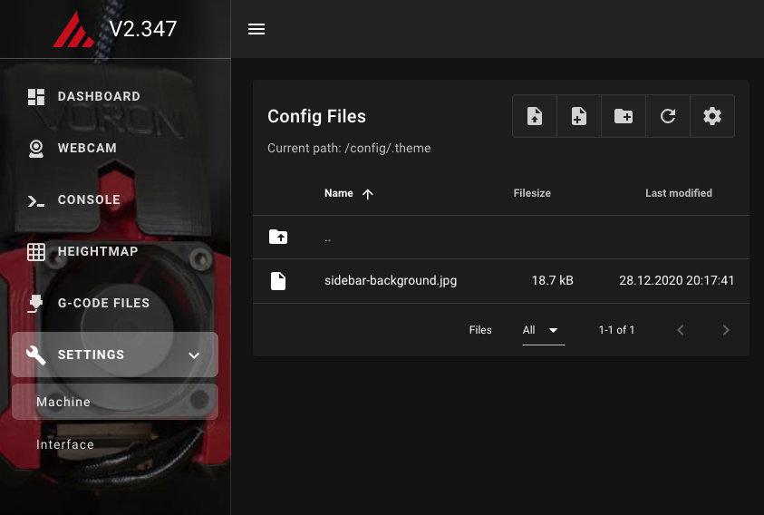

# {{ page.title }}
{{ page.description }}

At the moment there are two background images that can be set. In the sidebar- and mainview.

{:width="50%"}

For uploads you can use the built-in file manager. `(Settings > Machine)`

<!--  -->

## Sidebar background image
Just load a background image into your .theme folder and name it `sidebar-background.<extension>`.

| Filename					| sidebar-background	|
| Valid file extensions		| .jpg, .png and .gif	|
| Recommended image size	| 300x1000px			|

## Mainview background image
Upload a background image into your .theme folder and name it `main-background.<extension>`.

| Filename					| main-background		|
| Valid file extensions		| .jpg, .png and .gif	|

**Please note**: By default, the background image is stretched to the entire area.  
For example, if you want a repeating pattern, you also need to use custom css.
{: .info}