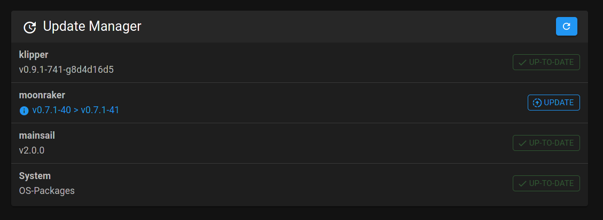

# Update Manager

You can find further information on this topic in the [Moonraker documentation](https://github.com/Arksine/moonraker/blob/master/docs/configuration.md#update_manager){:target="_blank"}.
{: .info}

## Enabling Update Manager

To use the built in Update Manager it must first be enabled by editing the `moonraker.conf` file.  From a terminal navigate to Klipper's configuration directory and edit the configuration file:

```bash
cd ~/klipper_config
sudo nano moonraker.conf
```
Add the following section to your printer's `moonraker.conf`:

```yaml
[update_manager]

[update_manager client mainsail]
type: web
repo: mainsail-crew/mainsail
path: ~/mainsail
```

Restart  Moonraker:
```bash
sudo systemctl restart moonraker
```

## Using Mainsail to Update

With the update manager enabled, reload your web browser and select the 'Machine' tab from the sidebar. You should now see the Update Manager panel.

Holding shift while clicking the browser's refresh button (or pressing Control + F5) will force it to reload the page fully without the cache.
{: .info}

The update order is top to bottom.



To update a component, click the  'UPDATE' button next to the component you wish to update:


A popover window will launch and the component will be updated. When the update is finished, you can close the window.

